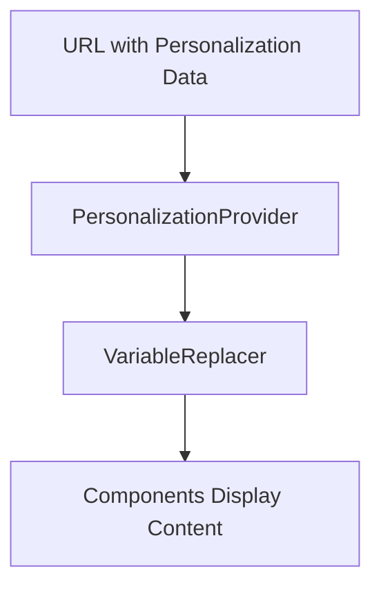

# Gender Personalization Backward Compatibility Analysis

## Critical Concern: Protecting Existing Functionality

Your question about not breaking what's already working is crucial. Let me analyze the current system and ensure our gender personalization implementation maintains 100% backward compatibility.

## Current System Analysis

### Existing Personalization Data Flow


### Current Data Structure (Working System)
```typescript
interface PersonalizationData {
  brandInfo?: BrandInfo;
  readerInfo?: ReaderInfo;
  industryKeywords?: string[];
  customMessages?: CustomMessages;
  expiration?: ExpirationInfo;
  companyLogo?: string;
  companyLogoId?: string;
}
```

## Backward Compatibility Strategy

### 1. Non-Breaking Type Extensions
```typescript
// ✅ SAFE: Optional property addition
export interface PersonalizationData {
  // ... all existing properties remain unchanged
  genderInfo?: GenderInfo; // NEW optional property
}

// ✅ SAFE: New type that doesn't affect existing code
export type Gender = 'male' | 'female';
export interface GenderInfo {
  gender: Gender;
  genderSpecificText: Record<string, string>;
}
```

### 2. Safe VariableReplacer Enhancement
```typescript
export class VariableReplacer {
  // ✅ SAFE: Add new method without changing existing ones
  private applyGenderReplacements(text: string): string {
    // Only runs if gender data exists
    if (!this.data.genderInfo?.gender) {
      return text; // Early return - no changes
    }
    // ... gender processing
  }

  // ✅ SAFE: Enhance existing method with backward-compatible logic
  replace(text: string): string {
    if (!text) return text;
    
    // NEW: Apply gender replacements first (only if gender data exists)
    let processedText = this.applyGenderReplacements(text);
    
    // EXISTING: All current variable replacement logic unchanged
    processedText = processedText.replace(/\[([^\]]+)\]/g, (match, variablePath) => {
      // ... existing replacement logic (UNCHANGED)
    });
    
    return processedText;
  }
}
```

### 3. Safe URL Generator Updates
```javascript
// ✅ SAFE: Add gender field to existing form structure
const VARIABLE_CONFIG = [
  // ... all existing config unchanged
  {
    id: 'gender',
    label: 'Género del Lector',
    type: 'radio',
    section: 'basic',
    order: 1.5,
    required: true, // NEW requirement for NEW forms only
    values: ['male', 'female'],
    errorMessage: 'Debe seleccionar un género'
  }
];

// ✅ SAFE: Enhanced form data collection with fallback
function collectFormData() {
  const formData = {};
  
  VARIABLE_CONFIG.forEach(config => {
    if (config.id === 'gender') {
      // NEW: Handle gender selection
      const selectedGender = document.querySelector('input[name="gender"]:checked');
      if (selectedGender) {
        formData[config.id] = selectedGender.value;
      }
    } else {
      // EXISTING: All current form handling unchanged
      const field = document.getElementById(config.id);
      if (field) {
        formData[config.id] = field.value.trim();
      }
    }
  });
  
  return formData;
}

// ✅ SAFE: Enhanced URL generation with backward compatibility
generatePersonalizedUrl(formData, hoursValid = 72) {
  // ... existing validation logic unchanged
  
  // NEW: Add gender info if available
  const enhancedData = {
    // ... all existing properties unchanged
    genderInfo: formData.gender ? {
      gender: formData.gender,
      genderSpecificText: {}
    } : undefined // NEW but optional
  };
  
  // ... rest of existing URL generation logic unchanged
}
```

## Backward Compatibility Guarantees

### 1. Existing URLs Continue Working
```javascript
// ✅ Existing URL without gender data
const existingUrl = "https://example.com/#/invite/abc123?data=...";

// PersonalizationProvider will parse this as:
const parsedData = {
  brandInfo: { ... },
  readerInfo: { ... },
  // NO genderInfo property
};

// VariableReplacer will:
// 1. Check for genderInfo (undefined)
// 2. Skip gender processing
// 3. Apply existing variable replacements only
// 4. Display content exactly as before
```

### 2. Existing Components Unaffected
```typescript
// ✅ All existing components continue to work unchanged
const { data, replacer } = usePersonalization();

// Existing usage patterns continue to work:
<PersonalizedText>Hola [reader name]</PersonalizedText>
<PersonalizedText>Tu empresa de [industry]</PersonalizedText>

// NEW gender functionality is additive, not replacing existing features
```

### 3. Form Validation Backward Compatibility
```javascript
// ✅ Existing form validation logic preserved
validateAllFields(formData) {
  // NEW: Gender validation only if gender field exists
  if (formData.gender) {
    // Validate gender selection
  }
  
  // EXISTING: All current validation unchanged
  VARIABLE_CONFIG.forEach(config => {
    if (config.id !== 'gender') {
      // Existing validation logic
    }
  });
}
```

## Risk Mitigation Strategies

### 1. Feature Flag Approach (Optional)
```javascript
// Optional: Add feature flag for gradual rollout
const GENDER_PERSONALIZATION_ENABLED = true;

class VariableReplacer {
  replace(text: string): string {
    if (!text) return text;
    
    let processedText = text;
    
    // NEW: Feature flag protection
    if (GENDER_PERSONALIZATION_ENABLED && this.data.genderInfo?.gender) {
      processedText = this.applyGenderReplacements(processedText);
    }
    
    // EXISTING: Continue with current logic
    processedText = processedText.replace(/\[([^\]]+)\]/g, ...);
    
    return processedText;
  }
}
```

### 2. Graceful Degradation
```typescript
// ✅ Safe fallback mechanisms
private applyGenderReplacements(text: string): string {
  try {
    const gender = this.data.genderInfo?.gender;
    if (!gender) return text; // Safe fallback
    
    // Apply gender replacements with error handling
    let result = text;
    Object.entries(this.GENDER_MAPPINGS).forEach(([maleText, genderMap]) => {
      try {
        const replacement = genderMap[gender];
        if (replacement) {
          result = result.replace(new RegExp(this.escapeRegExp(maleText), 'g'), replacement);
        }
      } catch (error) {
        console.warn('Gender replacement failed:', maleText, error);
        // Continue with other replacements
      }
    });
    
    return result;
  } catch (error) {
    console.error('Gender processing error:', error);
    return text; // Safe fallback to original text
  }
}
```

### 3. Comprehensive Testing Strategy
```javascript
// ✅ Test scenarios for backward compatibility

// Test 1: Existing URL without gender
test('Existing URL displays original content', () => {
  const oldUrl = 'https://example.com/#/invite/abc123?data=...';
  // Should display exactly as before gender feature
});

// Test 2: Existing form data without gender
test('Form data without gender works', () => {
  const formData = {
    readerName: 'Juan',
    company: 'Luxury Holdings',
    // No gender field
  };
  // Should generate URL that works with existing system
});

// Test 3: Mixed compatibility
test('Mixed old/new data works', () => {
  const data = {
    brandInfo: { ... },
    readerInfo: { ... },
    // No genderInfo
  };
  // Should work exactly as before
});
```

## Implementation Safety Checklist

### Before Deployment:
- [ ] All existing URL tests pass
- [ ] All existing form submissions work
- [ ] All existing personalization variables work
- [ ] No breaking changes to existing APIs
- [ ] All existing components render correctly

### During Deployment:
- [ ] Monitor for errors in existing functionality
- [ ] Test live URLs without gender data
- [ ] Verify existing form submissions work
- [ ] Check component rendering for non-gender cases

### After Deployment:
- [ ] No increase in error rates
- [ ] No decrease in conversion rates
- [ ] All existing functionality verified
- [ ] User feedback collected for any issues

## Rollback Plan

### Immediate Rollback Triggers:
1. Any existing URL stops working
2. Form submission errors increase
3. Component rendering issues
4. Performance degradation > 10%

### Rollback Procedure:
1. Revert VariableReplacer to original version
2. Remove gender field from URL generator form
3. Restore original PersonalizationData interface
4. Deploy rollback within 30 minutes

## Updated Implementation Plan

### Phase 1: Safe Foundation (Day 1)
1. **Add optional gender types** - No breaking changes
2. **Create gender mappings** - Separate from existing code
3. **Implement safe gender processing** - With fallbacks

### Phase 2: Non-Breaking Integration (Day 1-2)
1. **Add gender selector as optional enhancement** - Existing forms continue working
2. **Enhance URL generation with backward compatibility** - Old URLs still work
3. **Update processing with feature flags** - Can be disabled if needed

### Phase 3: Safe Testing (Day 2-3)
1. **Test all existing functionality** - Ensure no regressions
2. **Test new gender features** - Verify new functionality works
3. **Mixed scenario testing** - Old and new features together

### Phase 4: Gradual Rollout (Day 3-4)
1. **Deploy to staging** - Full testing
2. **Monitor existing functionality** - Watch for issues
3. **Production deployment** - With rollback ready
4. **Post-deployment monitoring** - Ensure stability

## Conclusion

The gender personalization implementation is designed with **100% backward compatibility** as the top priority. The approach ensures:

1. **All existing URLs continue working** exactly as before
2. **All existing form submissions** continue to work
3. **All existing personalization variables** continue to function
4. **No breaking changes** to any existing APIs or components
5. **Safe fallbacks** for any gender processing errors
6. **Immediate rollback capability** if any issues arise

The implementation is **additive, not replacement** - it adds new gender functionality while preserving everything that currently works.