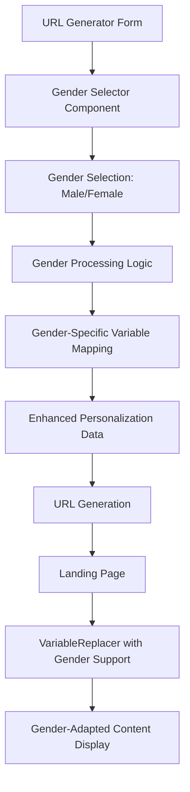

# Gender-Based Personalization Implementation Plan

## Overview
This document outlines the implementation of a gender-based personalization system for the URL generator and landing page. The system will allow users to select between male and female-oriented content, with specific text modifications for each gender.

## Requirements Summary
- Binary gender selection (male/female)
- Specific text replacements for 19 key phrases (provided by user)
- Gender selector in URL generator form
- Automatic content adaptation based on selection
- Seamless integration with existing personalization system

## Architecture Overview



## Implementation Phases

### Phase 1: Data Structure & Type Definitions

#### 1.1 Update Personalization Types
- Extend `src/types/personalization.ts` to include gender information
- Add gender-specific content interfaces
- Define gender mapping types

#### 1.2 Create Gender Variable Mapping
- Define the 19 specific text replacements for male/female
- Create lookup tables for efficient gender-based text replacement
- Establish gender variable naming conventions

### Phase 2: URL Generator Enhancements

#### 2.1 Gender Selector Component
- Add gender selector to `public/url-generator.html`
- Design UI with male/female radio buttons or toggle
- Position selector prominently in basic information section
- Add validation for gender selection

#### 2.2 Form Processing Updates
- Modify form data collection to include gender
- Update validation logic to require gender selection
- Enhance progress tracking to include gender step
- Update preview generation to show gender-adapted content

#### 2.3 URL Generation Logic
- Modify `EnhancedURLGenerator` class to process gender
- Include gender in personalization data structure
- Ensure gender data is properly encoded in URLs
- Maintain backward compatibility with existing URLs

### Phase 3: Content Processing System

#### 3.1 VariableReplacer Enhancement
- Update `src/utils/variableReplacer.ts` for gender support
- Add gender-aware text replacement logic
- Implement gender-specific variable lookup
- Maintain existing functionality for non-gendered content

#### 3.2 Gender Content Templates
- Create gender-specific content templates
- Implement the 19 specified text replacements
- Design flexible system for future gender additions
- Ensure consistent application across all components

### Phase 4: Integration & Testing

#### 4.1 Component Integration
- Update all landing page components to use gender-aware personalization
- Test gender personalization across all sections
- Verify proper fallback to default content
- Ensure responsive design works with gender selection

#### 4.2 Testing & Validation
- Test URL generation with both gender options
- Verify content replacement accuracy
- Test edge cases and error handling
- Validate mobile compatibility

## Technical Implementation Details

### Gender Variable Mapping

The system will implement the following 19 specific replacements:

| Male Text | Female Text |
|-----------|-------------|
| "estimado empresario" | "estimada empresaria" |
| "el que se declara rey" | "quien se declara líder absoluta" |
| "está listo para tomar ese lugar" | "está lista para tomar ese lugar" |
| "Estás listo para actuar" | "Estás lista para actuar" |
| "Padecés el 'Síndrome del Fundador Prisionero'" | "Padecés el 'Síndrome de la Fundadora Prisionera'" |
| "te convirtió en el mejor bombero" | "te convirtió en la mejor bombera" |
| "Ahora eres el estratega, no el bombero" | "Ahora sos la estratega, no la bombera" |
| "son la moneda de cambio de los perdedores" | "son la moneda de cambio de quienes pierden" |
| "'¡El rey ha vuelto!'" | "'¡La reina ha vuelto!'" |
| "No estás quemado - estás estratégicamente hambriento" | "No estás quemada - estás estratégicamente hambrienta" |
| "hay un rey en vos esperando salir" | "hay una reina en vos esperando salir" |
| "Y el mercado ya tiene un nuevo rey" | "Y el mercado ya tiene una nueva reina" |
| "Ese rey sos vos" | "Esa reina sos vos" |
| "a los débiles" | "a quienes no califican" |
| "eres campeón" | "sos campeona" |
| "ser el próximo rey" | "ser la próxima reina" |
| "si eres seleccionado" | "si sos seleccionada" |
| "Los reyes no se paralizan" | "Las reinas no se paralizan" |
| "El próximo rey será decidido" | "La próxima reina será decidida" |

### Data Structure Extensions

```typescript
// New types to add to personalization.ts
export type Gender = 'male' | 'female';

export interface GenderInfo {
  gender: Gender;
  genderSpecificText: Record<string, string>;
}

export interface PersonalizationData {
  // ... existing properties
  genderInfo?: GenderInfo;
}
```

### VariableReplacer Enhancement

The VariableReplacer class will be enhanced with:

1. **Gender Detection**: Check if gender info is available in personalization data
2. **Gender-Specific Replacement**: Apply gender-based text replacements before standard variable replacement
3. **Fallback Logic**: Use male text as default if gender is not specified
4. **Performance Optimization**: Cache gender mappings for efficient lookup

### URL Generator Form Changes

The `public/url-generator.html` will be updated with:

1. **Gender Selector Section**: Added to basic information section
2. **Form Validation**: Gender selection marked as required
3. **Preview Updates**: Real-time preview shows gender-adapted content
4. **Progress Tracking**: Include gender in completion percentage

## Implementation Order

1. **Data Structure Setup** (Day 1)
   - Update TypeScript interfaces
   - Create gender mapping constants
   - Define replacement logic

2. **URL Generator Updates** (Day 1-2)
   - Add gender selector UI
   - Update form processing
   - Enhance preview functionality

3. **Content Processing** (Day 2-3)
   - Update VariableReplacer class
   - Implement gender-specific content logic
   - Test replacement accuracy

4. **Integration & Testing** (Day 3-4)
   - Update all components
   - Comprehensive testing
   - Documentation updates

## Success Criteria

- [ ] Gender selector appears in URL generator form
- [ ] Male selection produces original content
- [ ] Female selection produces gender-adapted content
- [ ] All 19 text replacements work correctly
- [ ] Generated URLs include gender information
- [ ] Landing pages display gender-appropriate content
- [ ] Backward compatibility maintained for existing URLs
- [ ] Mobile design works with gender selector
- [ ] No performance degradation

## Risk Mitigation

### Potential Issues
1. **Backward Compatibility**: Existing URLs without gender data
   - Solution: Default to male content for backward compatibility

2. **Performance Impact**: Additional text processing
   - Solution: Optimize with caching and efficient lookup tables

3. **Content Consistency**: Missing gender replacements
   - Solution: Comprehensive testing and fallback mechanisms

4. **Mobile Usability**: Gender selector on small screens
   - Solution: Responsive design with touch-friendly controls

## Future Enhancements

1. **Gender-Neutral Option**: Add non-binary/gender-neutral option
2. **Dynamic Gender Detection**: Auto-detect based on reader's name
3. **Advanced Content Adaptation**: Beyond simple text replacement
4. **A/B Testing**: Test gender-specific conversion rates
5. **Analytics Integration**: Track gender-based engagement metrics

## Testing Strategy

### Unit Tests
- Gender replacement logic accuracy
- VariableReplacer gender functionality
- Form validation with gender selection

### Integration Tests
- End-to-end URL generation with gender
- Landing page content display
- Mobile compatibility testing

### User Acceptance Tests
- Gender selector usability
- Content appropriateness for each gender
- Overall user experience flow

## Documentation Updates

1. **Technical Documentation**: Update architecture diagrams and code comments
2. **User Guide**: Document gender selection process
3. **Developer Guide**: Explain gender personalization implementation
4. **Testing Guide**: Gender-specific testing procedures

## Conclusion

This implementation will provide a robust gender-based personalization system that maintains backward compatibility while adding powerful new functionality. The modular approach ensures easy maintenance and future enhancements.