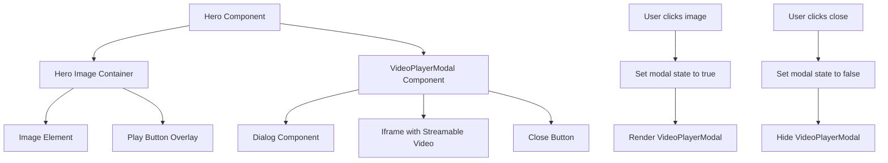
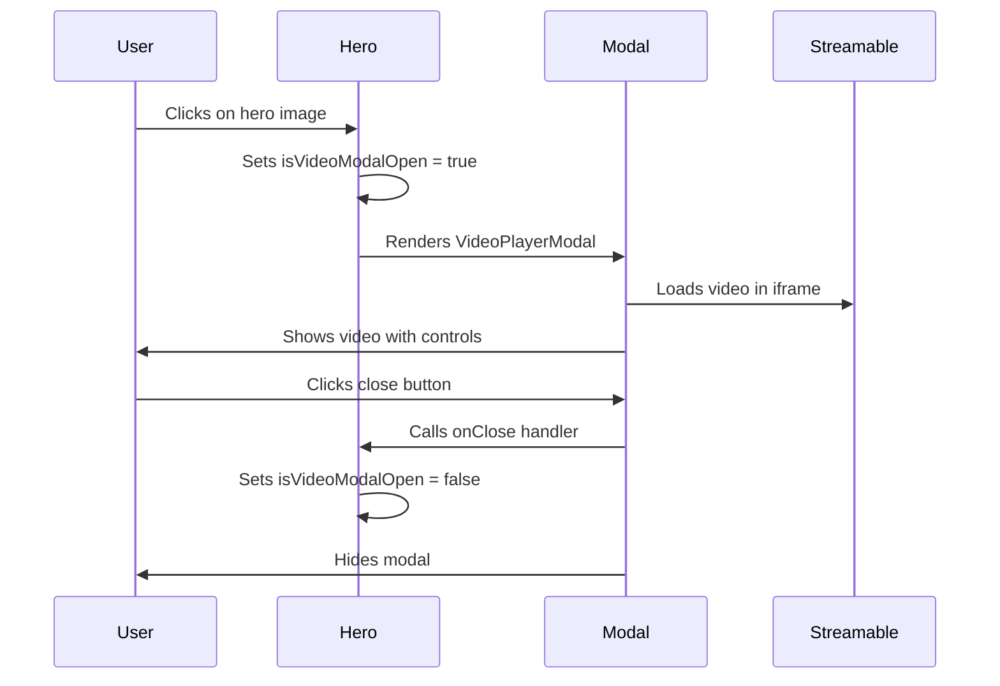
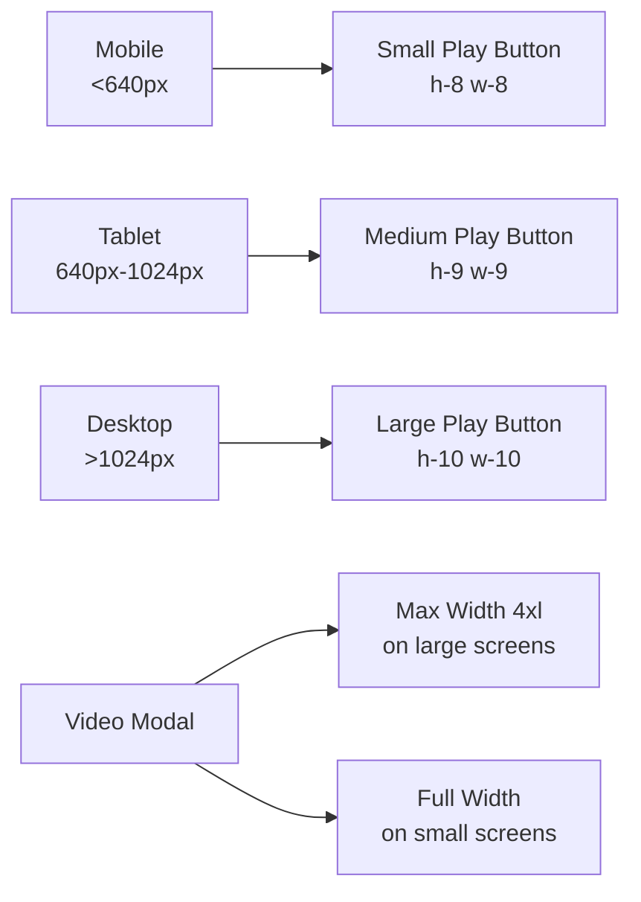

# Hero Video Implementation Architecture

## Component Structure



## User Interaction Flow



## State Management

```typescript
// Hero Component State
interface HeroState {
  isVideoModalOpen: boolean;
}

// State Actions
const openVideoModal = () => setIsVideoModalOpen(true);
const closeVideoModal = () => setIsVideoModalOpen(false);
```

## Responsive Breakpoints



## Styling Architecture

### Hero Image Container
```css
.hero-image-container {
  @apply relative rounded-2xl sm:rounded-3xl overflow-hidden 
         shadow-strong cursor-pointer group;
  aspect-ratio: 4/5;
  @media (sm) { aspect-ratio: 3/4; }
  @media (md) { aspect-ratio: 5/4; }
  @media (lg) { aspect-ratio: 4/3; }
}
```

### Play Button Overlay
```css
.play-button-overlay {
  @apply absolute inset-0 flex items-center justify-center 
         opacity-0 group-hover:opacity-100 
         transition-opacity duration-300;
}

.play-button {
  @apply bg-accent/90 rounded-full p-4 sm:p-6 
         shadow-strong transform scale-95 
         group-hover:scale-100 transition-transform;
}
```

### Video Modal
```css
.video-modal {
  @apply max-w-4xl w-full p-0 overflow-hidden;
}

.video-iframe {
  @apply w-full h-full border-0;
  aspect-ratio: 16/9;
}
```

## Component Props Interface

```typescript
// VideoPlayerModal Props
interface VideoPlayerModalProps {
  isOpen: boolean;
  onClose: () => void;
  videoUrl: string;
}

// Hero Component (existing props + new state)
interface HeroProps {
  // ... existing props
  videoUrl?: string; // Optional prop for customization
}
```

## Implementation Benefits

1. **Reusability**: VideoPlayerModal can be used in other components
2. **Maintainability**: Clean separation of concerns
3. **Accessibility**: Proper ARIA labels and keyboard navigation
4. **Performance**: Lazy loading of video content
5. **Responsive**: Works across all device sizes
6. **User Experience**: Smooth animations and intuitive interactions

## Technical Considerations

### Streamable Integration
- Uses embed URL format: `https://streamable.com/e/{shortcode}`
- Extracts shortcode from full URL automatically
- Enables fullscreen and autoplay permissions

### State Management
- Local state in Hero component (no external state needed)
- Simple boolean flag for modal visibility
- Clean event handlers for open/close actions

### Performance Optimizations
- Video only loads when modal is opened
- Image maintains eager loading for LCP performance
- Efficient CSS transitions using transform properties

### Browser Compatibility
- Uses standard iframe embedding (universal support)
- CSS Grid and Flexbox (modern browsers)
- Fallbacks for older browsers if needed