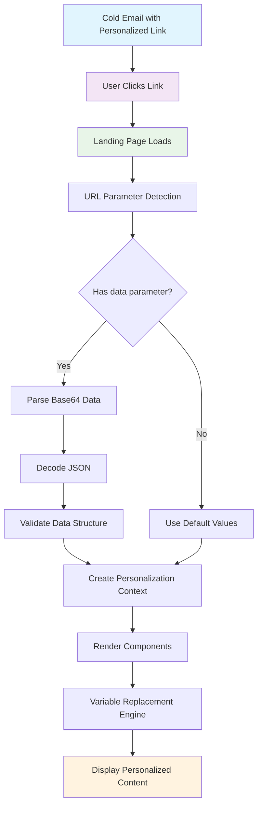
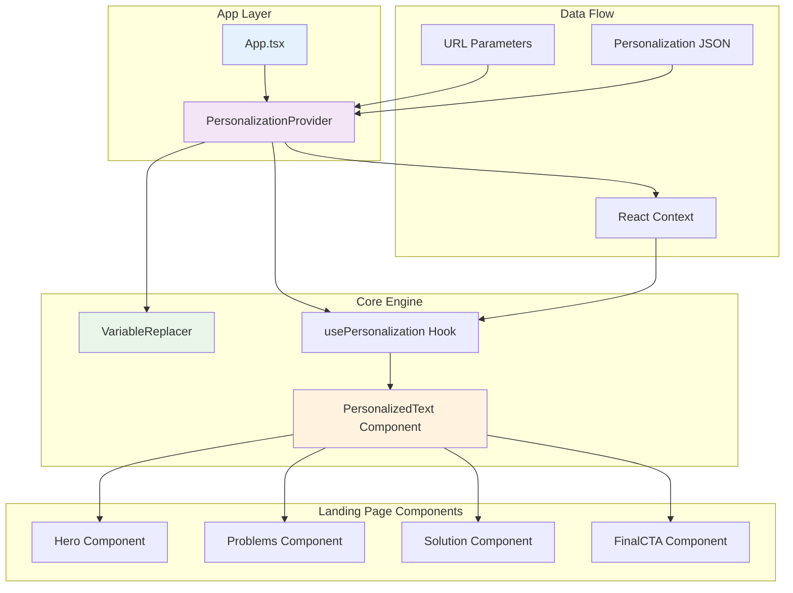
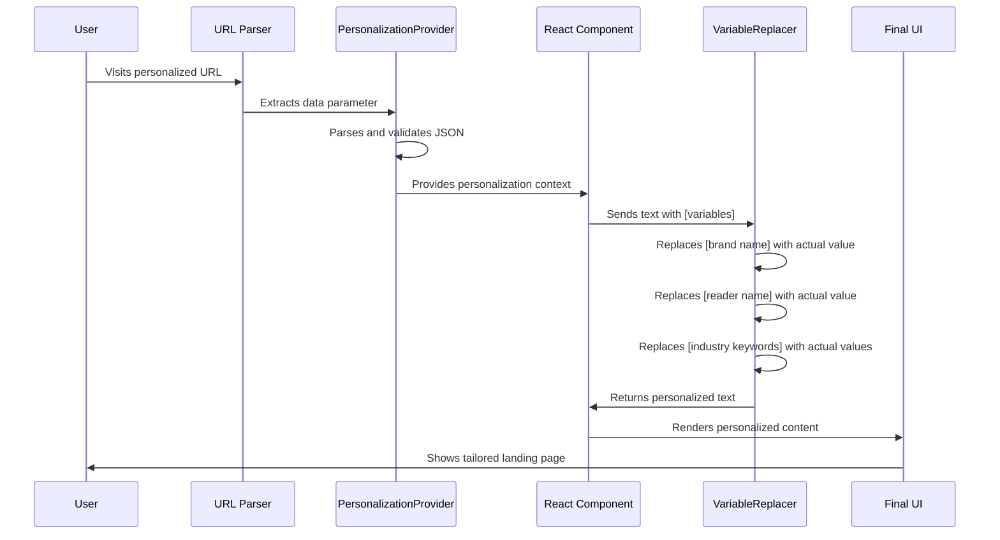
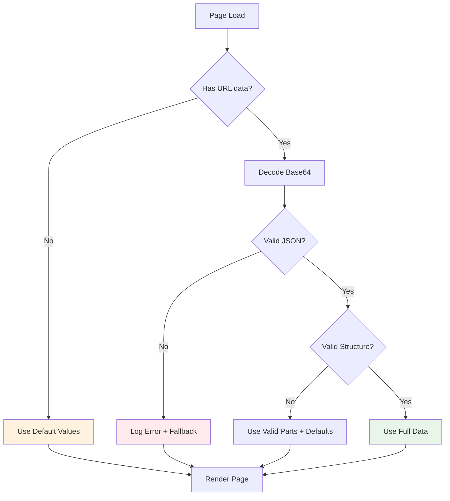
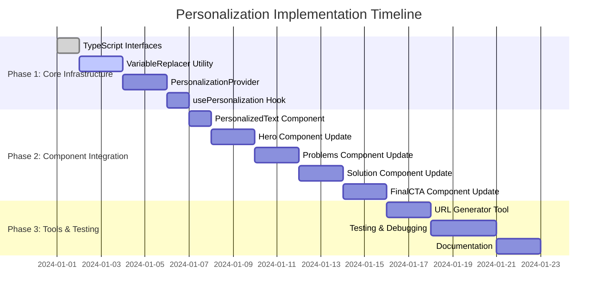

# Personalization System Architecture Diagram

## System Flow

## Component Architecture

## Data Structure Flow

```mermaid
graph LR
    subgraph "Email Campaign"
        EMAIL[Email Template]
        DATA[Personalization Data]
    end
    
    subgraph "URL Generation"
        ENCODE[Base64 Encoding]
        URL_GEN[URL Creation]
    end
    
    subgraph "Landing Page"
        PARAMS[URL Parameters]
        DECODE[JSON Decode]
        VALIDATE[Data Validation]
        CONTEXT[Context Creation]
    end
    
    subgraph "Component Rendering"
        REPLACE[Variable Replacement]
        RENDER[Component Render]
    end
    
    EMAIL --> DATA
    DATA --> ENCODE
    ENCODE --> URL_GEN
    URL_GEN --> PARAMS
    PARAMS --> DECODE
    DECODE --> VALIDATE
    VALIDATE --> CONTEXT
    CONTEXT --> REPLACE
    REPLACE --> RENDER
    
    style EMAIL fill:#e1f5fe
    style URL_GEN fill:#f3e5f5
    style CONTEXT fill:#e8f5e8
    style RENDER fill:#fff3e0
```

## Variable Replacement Process

## Error Handling Flow

## Implementation Timeline

## Key Benefits

1. **Scalability**: Easy to add new variables without changing core logic
2. **Maintainability**: Centralized personalization logic
3. **Performance**: One-time parsing, cached results
4. **Flexibility**: Support for nested data structures
5. **Reliability**: Graceful fallbacks and error handling
6. **Security**: Input validation and sanitization

## Success Metrics

- **Conversion Rate**: Measure improvement in conversion rates with personalized vs. non-personalized pages
- **Engagement**: Track time on page, scroll depth, and interaction rates
- **Lead Quality**: Monitor lead quality and sales team feedback
- **A/B Testing**: Compare different personalization strategies
- **Email Performance**: Measure email click-through rates with personalized links

## Next Steps

1. Review and approve the implementation plan
2. Set up development environment
3. Begin Phase 1 implementation
4. Regular progress reviews
5. User acceptance testing
6. Production deployment
7. Performance monitoring and optimization