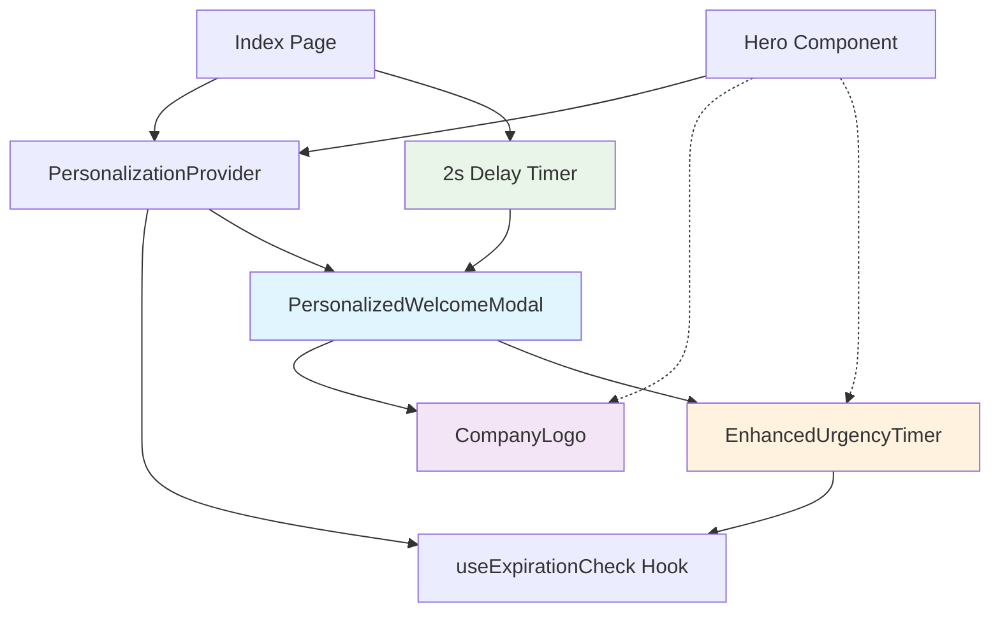
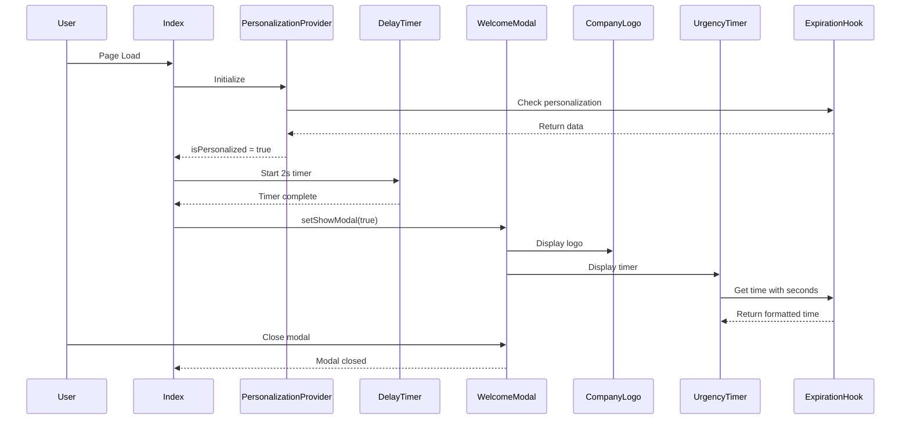
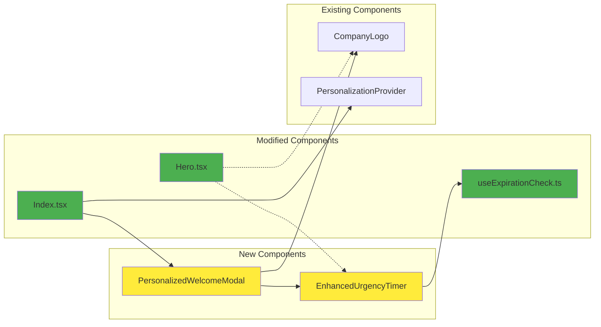
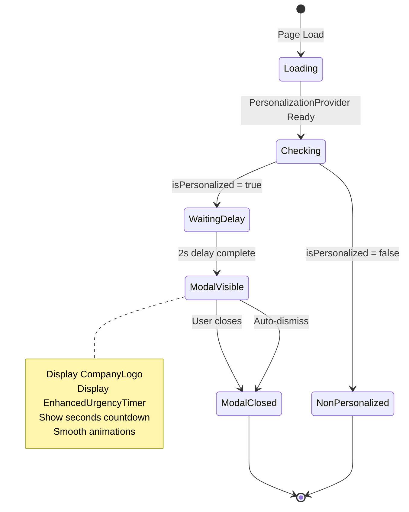
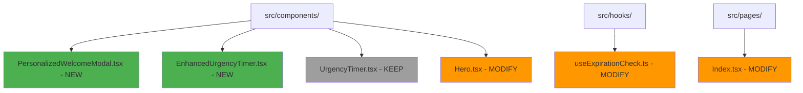

# PersonalizedWelcomeModal Architecture Diagram

## Component Relationship Flow



## Data Flow Architecture



## Component Structure Diagram



## Modal State Management Flow



## File Structure Changes



## Animation Timeline

```mermaid
gantt
    title Modal Animation Timeline
    dateFormat X
    axisFormat %s
    
    section Page Load
    Page Initialize    :0, 1s
    Personalization Check :1, 2s
    
    section Modal Trigger
    2s Delay          :2, 4s
    
    section Modal Display
    Fade In Animation :4, 4.5s
    Scale Animation   :4, 4.3s
    Content Display   :4.3, 5s
    
    section User Interaction
    Modal Active      :5, 30s
    User Close/Dismiss:30, 30.5s
```



## Responsive Design Breakpoints

```mermaid
graph LR
    subgraph "Mobile (< 640px)"
        A[Modal Width: 90%]
        B[Logo Size: Small]
        C[Timer Font: Medium]
    end
    
    subgraph "Tablet (640px - 1024px)"
        D[Modal Width: 80%]
        E[Logo Size: Medium]
        F[Timer Font: Large]
    end
    
    subgraph "Desktop (> 1024px)"
        G[Modal Width: 50%]
        H[Logo Size: Large]
        I[Timer Font: Extra Large]
    end
    
    style A fill:#ff5722
    style D fill:#2196f3
    style G fill:#4caf50